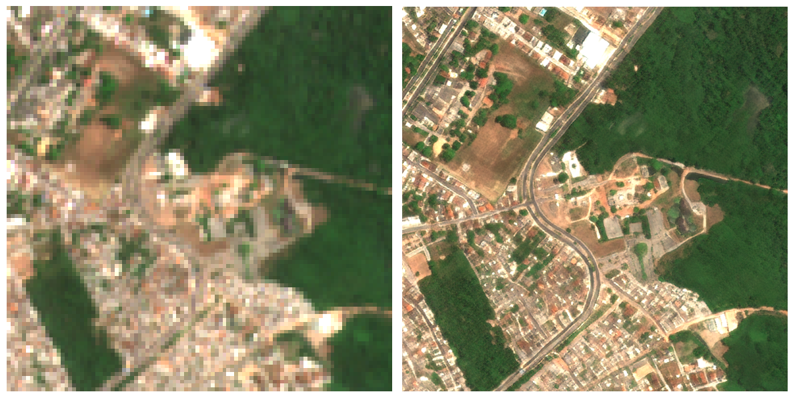

# 🌍 Gamma Earth S2DR3 - Sentinel-2 Deep Resolution 3.0

### Super-resolução eficaz de 10 bandas para imagens únicas do Sentinel-2

Este repositório apresenta uma adaptação demonstrativa do módulo **S2DR3**, criado pela equipe **Gamma Earth**.  
A adaptação inclui o uso do **Google Earth Engine** para a seleção automática da melhor imagem Sentinel-2, com base na menor cobertura de nuvens.

A versão original do trabalho foi publicada no artigo:  
> [Sentinel-2 Deep Resolution 3.0 - Gamma Earth](https://medium.com/@ya_71389/sentinel-2-deep-resolution-3-0-c71a601a2253)

Todos os créditos sobre o modelo e metodologia de super-resolução são devidos aos autores originais.

---

## 🔍 O que o módulo S2DR3 faz:

O módulo **S2DR3** realiza uma **super-resolução de imagem única**, ampliando as bandas espectrais de uma cena Sentinel-2 L2A (ou L1C) das resoluções originais de 10m, 20m e 60m por pixel para **1 metro por pixel (1m/px)**.

Este processo gera imagens multiespectrais com detalhes significativamente aumentados, úteis para aplicações ambientais, agrícolas e de monitoramento territorial.

---

## ⚙️ Fluxo da adaptação:

1. **Seleção automática da melhor imagem** no Google Earth Engine (GEE) baseada na menor cobertura de nuvens para a área de interesse.
2. **Processamento da imagem** pelo modelo S2DR3.
3. **Exportação dos produtos** em formato GeoTIFF.

---

## 📁 Produtos gerados:

Após a execução, são gerados quatro arquivos no diretório `/content/output`:

- `S2L2Ax10_T[MGRS]-[DATA]-[UID]_MS.tif` — Imagem multiespectral com 10 bandas (1m/px)
- `S2L2Ax10_T[MGRS]-[DATA]-[UID]_TCI.tif` — Imagem RGB em cores reais (True Color)
- `S2L2Ax10_T[MGRS]-[DATA]-[UID]_NDVI.tif` — Imagem em pseudocores do índice NDVI
- `S2L2Ax10_T[MGRS]-[DATA]-[UID]_IRP.tif` — Imagem em pseudocores infravermelho

---

## 📊 Ordem das bandas no produto multiespectral:

- **B02** (Azul)
- **B03** (Verde)
- **B04** (Vermelho)
- **B05** (Borda Vermelha 1)
- **B06** (Borda Vermelha 2)
- **B07** (Borda Vermelha 3)
- **B08** (Infravermelho Próximo - NIR)
- **B8A** (Infravermelho Próximo Estreito)
- **B11** (Infravermelho de Onda Curta 1 - SWIR 1)
- **B12** (Infravermelho de Onda Curta 2 - SWIR 2)

---

## 📸 Demonstração Visual

A imagem abaixo ilustra a comparação entre a resolução original da cena Sentinel-2 (à esquerda) e o resultado obtido após a aplicação do modelo **S2DR3** (à direita), com resolução aprimorada para **1 metro por pixel**.

> 🔎 À esquerda: Sentinel-2 original | À direita: Resultado S2DR3

---

## 📖 Créditos:

- Modelo: **Gamma Earth** ([Artigo original](https://medium.com/@ya_71389/sentinel-2-deep-resolution-3-0-c71a601a2253))
- Implementação adicional: ([Samuel Santos](https://github.com/samuel-c-santos))

Este projeto é apenas uma adaptação demonstrativa para fins educacionais e de experimentação, sem uso comercial.

---

## 📬 Contato:

Para informações sobre licenciamento ou uso comercial do S2DR3, entre em contato com a Gamma Earth:  
📧 **info@gamma.earth**
